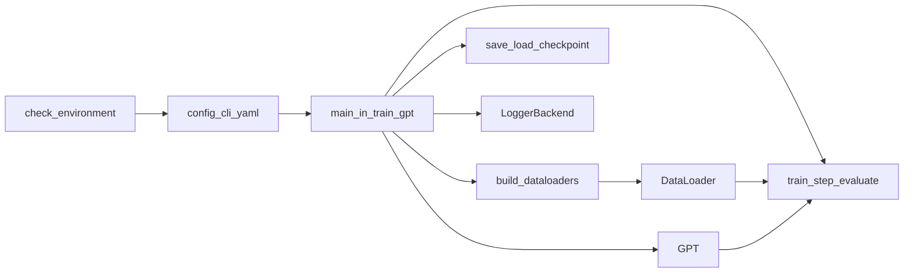

# 通用可配置模型训练脚本（单文件 + 文件内模块化）

**概述**：在空仓库中用**单一 Python 源文件**实现 PyTorch 优先、命令行 + 可选 YAML 驱动的字符/BPE 级 GPT 训练器；文件内按职责分块（配置、设备、数据、模型、引擎、检查点、主循环），保持与多文件工程同等的清晰度与可维护性。

## 任务清单

- [x] 添加 `requirements.txt`；可选 `configs/default.yaml`；设计单文件内分区与 `TrainConfig` / dataclass；实现 `check_environment`（运行前依赖与设备检查）；实现启动时 `print_startup_report`（全量参数 + 运行时变量）
- [x] 在单文件中实现配置解析（argparse + YAML）、设备/RNG、数据流水线（char/BPE、DataLoader）
- [x] 同文件内实现模块化 GPT 类族、训练步/评估/生成、余弦 + warmup、梯度裁剪、可选 AMP
- [x] 同文件内实现 checkpoint 存取（model/opt/sched/scaler/RNG）、主循环、早停、TensorBoard/WandB、生成预览

---

## 现状

[`model_training_script`](.) 目录下目前**没有 Python 源码**（仅 `.git`）。本计划按五大能力**从零实现**，但**全部落在单一 `.py` 文件中**，通过**分区与命名**维持高度独立的模块化设计。

## 交付形态与仓库布局

- **核心代码**：一个入口脚本，建议命名 [`train_gpt.py`](train_gpt.py)（或你指定的名称）。`python train_gpt.py --help` 即完整入口。
- **仍可出现于仓库的非 Python 文件**（不违背「单文件」目标）：
  - [`requirements.txt`](requirements.txt)：`torch`、`pyyaml`、`tqdm`、可选 `wandb` / `tensorboard` / `tiktoken`
  - 可选 [`configs/default.yaml`](configs/default.yaml)：默认超参；由 `--config` 加载，CLI 覆盖

```text
model_training_script/
  plan.md
  requirements.txt
  configs/
    default.yaml          # 可选
  train_gpt.py             # 唯一 Python 源码：内含全部模块逻辑
```

## 单文件内如何保持「高度独立模块化」

在 **`train_gpt.py` 内自上而下**用**统一分隔区段**组织（示例顺序可微调），每个区段只依赖上方已声明的类型/函数，避免 spaghetti：

| 区段（文件内） | 职责 |
|----------------|------|
| **Imports 与类型别名** | 标准库、`torch`、可选依赖的 lazy/try import |
| **`check_environment()`（或拆成两阶段函数）** | 在**任何数据加载、模型构建、训练循环之前**完成依赖与一致性检查；失败则 **`sys.exit(1)`**（或固定非零码）并给出**可操作的**英文或中英提示（缺何包、如何安装、`--device` 与硬件不匹配等） |
| **`TrainConfig`（dataclass）** | 所有可配置字段的单一真相来源；或由解析函数填充实例 |
| **`parse_args()` / `load_merged_config()`** | `argparse` + YAML 合并（`defaults < yaml < cli`）；落盘 `out_dir/.../config_resolved.yaml` |
| **`setup_device_and_threads()`** | `cuda` / `mps` / `cpu`、`torch.set_num_threads`、`set_seed`（`torch` / `random` / `numpy`） |
| **`Tokenizer` / `CharTokenizer` / 可选 BPE** | `encode` / `decode`；字符级 OOV 不适用；BPE 可选 `tiktoken` |
| **`TextDataset` + `build_dataloaders()`** | 文本加载、train/val 划分、`DataLoader`（`shuffle`、`num_workers`、`pin_memory` 等） |
| **Model：`CausalSelfAttention`、`MLP`、`Block`、`GPT`** | 与 nanoGPT 风格对齐；初始化；`count_parameters()` |
| **`lr_scheduler` 工厂** | warmup + 余弦至 `min_lr` |
| **`train_step()` / `evaluate()` / `generate_sample()`** | 前向、loss、反向、梯度裁剪、可选 AMP |
| **`save_checkpoint()` / `load_checkpoint()`** | `model` / `optimizer` / `scheduler` / `scaler` / RNG / `step` / `best_val_loss` / 可选整份 resolved config |
| **`LoggerBackend`（小类或函数表）** | TensorBoard / WandB / none |
| **`main()`** | **最先**执行环境检查（见「运行前环境依赖检查」）；再解析配置；首轮训练步之前调用「启动全量打印」；组装、resume、循环、`eval_interval`、`checkpoint_interval`、`early_stop`、`sample_interval` |
| **`print_startup_report()`（或等价）** | 人类可读地输出**全部已解析配置**与**关键运行时变量**（见下文「启动时全量打印」） |

约定：**类与函数以模块名前缀或清晰动词命名**（如 `build_dataloaders`, `save_checkpoint`），区段标题使用固定格式的注释，例如：

```python
# ---------------------------------------------------------------------------
# 2. Data pipeline
# ---------------------------------------------------------------------------
```

这样单文件仍可通过「跳转到符号 / 搜索区段标题」快速导航，心智负担接近多文件包。

**数据流（概念）**



## 运行前环境依赖检查（硬性要求）

在 **`main()` 最开头**（或解析完 CLI 后立刻，见下）执行检查，确保**不在缺依赖或错误设备假设下**才开始读数据、建模型。建议分为 **两阶段**，避免未解析 `--device` / `--tokenizer` 时无法判断：

### 阶段 A：硬性运行时依赖（不依赖 YAML / 合并后 config）

在**尽可能早**的时机执行（通常在 `main()` 入口、`parse_args` 之前或紧跟最小 `argparse` 解析以便 `--help` 仍可退出），检查项包括：

- **Python 版本**：例如要求 `>= 3.10`，不满足则退出并提示升级。
- **必选第三方包**：至少能成功 import 且版本可读（如 **`torch`**、**`yaml`**（PyYAML）、**`tqdm`**）。缺失时打印**包名 + pip/conda 安装示例**，不进入训练。
- **PyTorch 编译信息（摘要）**：可选打印 `torch.__version__`、是否编进 CUDA/MPS（便于用户自查装错轮子），**不作为失败条件**（除非你在阶段 B 要求用 GPU）。

阶段 A 失败：**非零退出**，stderr 或 stdout 中单条信息即可读、可执行。

### 阶段 B：与配置一致的环境与资源（依赖合并后的 `TrainConfig`）

在 **`argparse` + YAML 合并得到最终 `TrainConfig` 之后**、**调用 `setup_device_and_threads` / 创建 DataLoader 之前**再执行一次（可与 `setup_device` 合并实现，但逻辑上须覆盖下列点）：

- **`--device` 与硬件**：若配置为 `cuda`，则要求 `torch.cuda.is_available()`，否则退出并提示改用 `cpu`/`mps` 或安装 GPU 版 PyTorch；若配置为 `mps`，则要求 `torch.backends.mps.is_available()`（API 以当前 torch 文档为准）；`auto` 时明确文档化回落顺序（如 `cuda` → `mps` → `cpu`），并在检查阶段打印**实际选用**设备。
- **可选功能与包**：若 `log_backend` 为 `wandb` / `tensorboard`，对应包应可 import，否则退出或（若你愿意**显式**降级）须在计划中写清策略——**默认建议严格失败**，避免「以为在记 WandB 实际没记」。
- **Tokenizer**：若配置为 BPE / `tiktoken`，则要求 **`tiktoken` 可 import**，否则退出并提示安装。
- **数据路径**：`data_dir`（或等效路径）存在且可读；若为目录则至少能发现预期 `.txt`（策略在实现中写清）；不存在则退出。

阶段 B 失败：同样 **非零退出**，信息中应包含**当前关键配置字段**（如 `device=...`, `data_dir=...`），便于一次修正。

### 与「启动全量打印」的关系

环境检查通过后再进行设备设置、数据与模型构建；**`print_startup_report` 仍在首个 `train_step` 之前**，可引用阶段 A/B 已收集的版本与可用性信息，避免重复代码。

## 1. 配置与超参数

- 在 **`TrainConfig`**（或等价结构）中集中定义字段；**`argparse`** 与可选 **`--config`** YAML 合并后写入该结构。
- 字段覆盖基础设施、训练、模型、I/O：`--device`, `--num_threads`, `--seed`, `--batch_size`, `--lr`, `--max_iters`, `--weight_decay`, `n_layer` / `n_head` / `n_embd` / `block_size`, `--data_dir`, `--out_dir`, `--eval_interval`, `--resume`, `--checkpoint`, `--config`, 以及 `grad_clip`, `warmup_iters`, `min_lr`, `early_stop_patience`, `sample_interval`, `log_backend` 等。
- 启动时**落盘**最终配置（透明、可复现）：与 `config_resolved.yaml` 等内容一致。

### 启动时全量打印（硬性要求）

在**进入第一个训练 step 之前**（完成设备设置、数据与模型构建后），必须向 stdout 打出一份**完整、可分节**的启动报告，便于对照日志与复现实验：

1. **全部已解析超参与路径**  
   - 以 `TrainConfig`（或合并后的 dict）为权威来源，**逐项打印**每一个字段（建议按固定字母序或按「基础设施 / 训练 / 模型 / I/O」分组），包含 CLI 与 YAML 合并后的**最终值**；布尔与枚举用明确字符串（如 `true`/`false`）。

2. **关键运行时变量（合并解析结果之后才能知道的信息）**  
   至少包括（有则打印，无则注明 `n/a`）：  
   - **PyTorch / Python**：`torch.__version__`、`sys.version` 摘要（一行）。  
   - **设备**：解析后的 `device` 字符串；若 CUDA：`torch.cuda.get_device_name(0)`、当前 device index；若 MPS：标明 `mps`。  
   - **线程**：实际生效的 `torch.get_num_threads()`（及若在代码里设置了 interop，也可打印）。  
   - **数据**：`data_dir` 解析路径、加载的文本总字节/字符量、train/val **样本块数量**或 token 划分说明、`vocab_size`、tokenizer 类型、`batch_size`、`num_workers`、`pin_memory` 等 DataLoader 相关最终值。  
   - **模型**：`n_layer` / `n_head` / `n_embd` / `block_size`（可与配置重复列出，便于一眼核对）、**总参数量 / 可训练参数量**（可与「模型」一节的专门打印合并，但启动报告里至少要出现一次）。  
   - **运行目录**：`out_dir`、`run` 子目录（若按时间戳创建）、`latest.pt` / `best.pt` 等将写入的路径提示。  
   - **续训**：若 `--resume` 或指定 checkpoint：加载的文件路径、恢复到的 `step` / `best_val_loss`（加载完成后打印）。

3. **格式**  
   - 使用清晰的分节标题（如 `=== Resolved configuration ===`、`=== Runtime ===`），避免一坨无结构 `print`。  
   - 可选：同时 `logging.info` 或写入 `out_dir` 下 `startup_log.txt`，与 stdout 二选一或并存由实现决定，但 **stdout 必须有完整输出**。

实现上建议集中为一个函数（如 `print_startup_report(config, runtime: dict)`），由 `main()` 在「一切就绪、尚未 `train_step`」时调用一次，避免逻辑散落。

## 2. 数据流水线

- **输入**：目录或单个 `.txt`（首期纯文本；PDF 为后续扩展）。
- **Tokenizer**：默认字符级；可选 `tiktoken`（安装则可用 `--tokenizer` 切换）。
- **划分**：可配置 `train_ratio` / `val_ratio`；实现时在注释中固定一种策略（切片或按文件）并写清。
- **`DataLoader`**：训练集 `shuffle=True`；`num_workers`、`pin_memory`（CUDA）、`persistent_workers`（workers>0）。

## 3. 模型

- 文件内 **`CausalSelfAttention`、`MLP`、`Block`、`GPT`**；合理权重初始化；启动时打印 total / trainable 参数量。

## 4. 训练与监控

- **损失**：next-token 交叉熵。
- **优化器**：AdamW。
- **调度**：warmup + 余弦退火至 `min_lr`。
- **梯度裁剪**：可配，0 关闭。
- **日志**：`tensorboard` / `wandb` / `none`，封装为小函数或薄类，避免 `main()` 臃肿。

## 5. 容灾与评估

- **Checkpoint**：保存并恢复 `model.state_dict()`、`optimizer.state_dict()`、`scheduler.state_dict()`；若启用 AMP 则包含 `GradScaler`；保存 `torch` / `random` / `numpy` RNG 状态以便严格续训。
- **验证**：`eval_interval` 上报告 `val_loss`、`perplexity`。
- **早停**：`early_stop_patience`（0 关闭）；连续若干次验证无改善则退出并保留 best。
- **生成预览**：`sample_interval` + 可配置 `prompt`，打印并可选追加到 `samples.txt`。

## 入口命令形态（目标）

```bash
python train_gpt.py \
  --config configs/default.yaml \
  --num_threads 12 \
  --lr 5e-4 \
  --resume \
  --out_dir runs/experiment1
```

## 依赖与约束

- **Python**：建议 3.10+。
- **PyTorch**：在 `requirements.txt` 中说明按环境选择 CUDA/CPU 轮子，不写死具体 cu 版本。
- **不引入 Lightning 等重型框架**（除非你后续要求）。

## 实施顺序建议（单文件内按区段自上而下填充）

1. **阶段 A** `check_environment_phase_a()` + `TrainConfig` + `parse_args` / YAML 合并 + **阶段 B** `check_environment_phase_b(config)` + `setup_device_and_threads`
2. Tokenizer + `TextDataset` + `build_dataloaders`
3. `GPT` 与参数量统计
4. `train_step` / `evaluate` / `generate_sample` + scheduler 工厂
5. `save_checkpoint` / `load_checkpoint` + `main` 循环（在首步训练前调用 `print_startup_report`；resume、早停、日志、生成）

## 风险与后续扩展

- **PDF**：可在同文件末尾或未来拆出第二脚本前，用独立函数 ingest，不混入 Dataset 核心逻辑。
- **多 GPU / DDP**：单文件仍可加 `torchrun`，但 sampler 与进程逻辑会使 `main` 变长；建议作为单独里程碑，必要时再拆 `main` 为 `_run_distributed` 子函数（仍在同一文件）。
